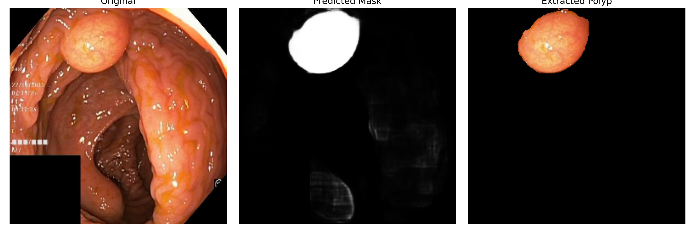
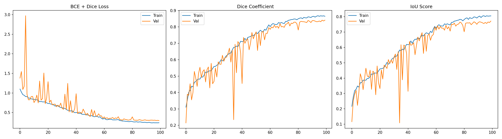

# Polyp Segmentation Using U-Net Architecture







For Activate GPU: 
```sh
# Final Fix:
export VENV_PACKAGES="/mnt/c/development/Thesis/Gastrovision/linux-venv/lib/python3.12/site-packages"

# Set Important Libraries:
export LD_LIBRARY_PATH=/usr/lib/wsl/lib:$VENV_PACKAGES/nvidia/cudnn/lib:$VENV_PACKAGES/nvidia/cublas/lib:$VENV_PACKAGES/nvidia/cuda_runtime/lib:$VENV_PACKAGES/nvidia/cusolver/lib:$VENV_PACKAGES/nvidia/cusparse/lib:$LD_LIBRARY_PATH


# Inform the System
sudo ldconfig
export TF_FORCE_GPU_ALLOW_GROWTH=true
```